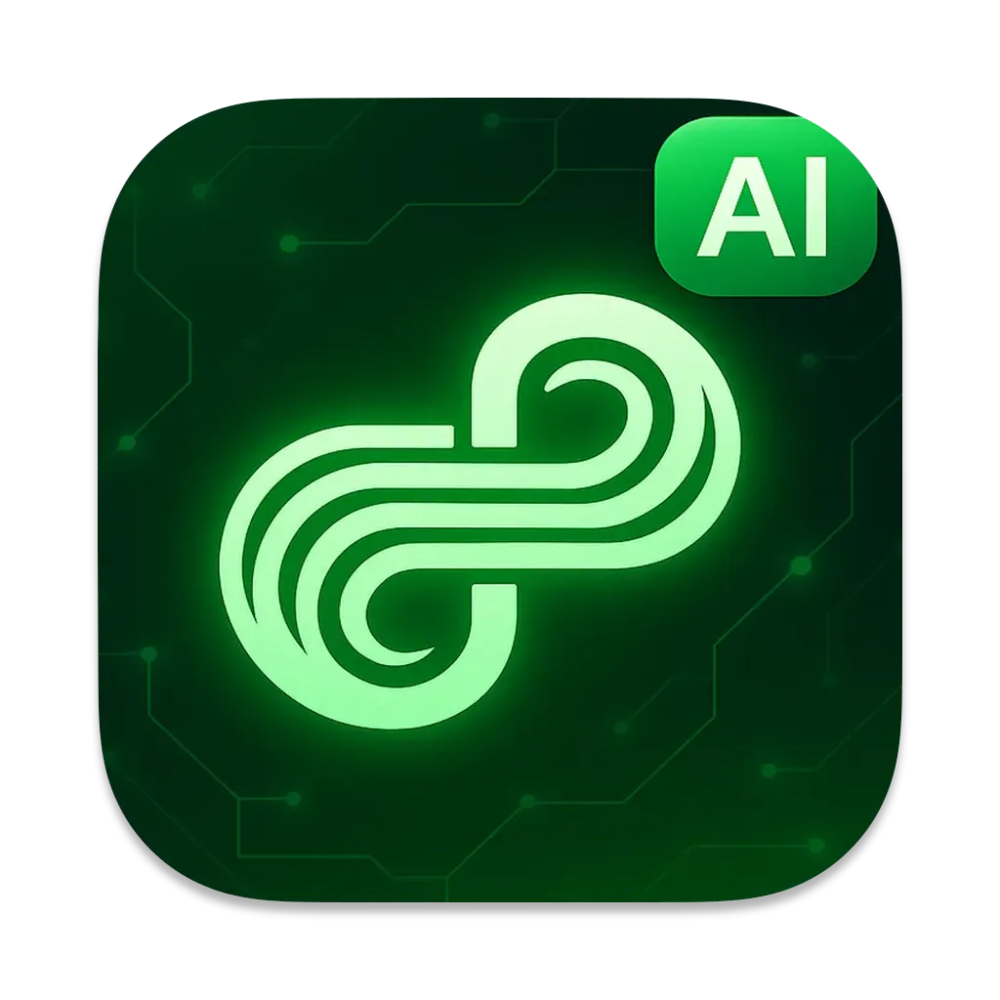

# noAI (nodleAI) agent

<div align="center">
  <a href="https://nodle.com">
    
  </a>
</div>

**noAI** is a lightweight macOS app that turns [Ollama](https://github.com/ollama/ollama)-powered language models into a coding and creativity companion.  
Think of it as a local-first AI agent where you can spin up different models (Llama, Gemma, code-specialized LLMs, etc.) and use them for tasks like:

- Coding help — write, debug, or refactor code with context-aware suggestions  
- Model switching — easily swap between multiple Ollama models depending on your use case  
- Creativity and brainstorming — not just for coding, but also writing, ideation, or general Q&A  
- Local-first privacy — runs on your machine via Ollama, so your prompts and data stay private  

It’s meant to feel like a “coding buddy” with a bit of personality — quick, local, and customizable completely offline.


## Features

- Multiple Model Support: Run and swap between LLMs like Llama, Gemma, DeepSeek LLMs directly on macOS  
- LoRA Fine-tuning: Load lightweight adapters to specialize a model on your own data  
- RAG (Retrieval-Augmented Generation): Connect your agent to local files, docs, or databases for grounded answers  
- MCP (Model Context Protocol): Extend your agent with tools, APIs, or external systems for custom workflows  
- Thread Management: Create, delete, rename, and organize chat threads  
- Export Options: Save chats as JSON or Markdown for later reference  


## Getting Started

### Prerequisites

1. **Install Ollama**  
   Follow the official installation guide: [https://github.com/ollama/ollama](https://github.com/ollama/ollama)  

   On macOS, you can use Homebrew:

   ```bash
   brew install ollama
   ```

2. **Run the Ollama server**  
   Start the Ollama daemon (it runs the models locally):

   ```bash
   ollama serve
   ```

   By default it listens on `http://127.0.0.1:11434`.

3. **Pull a model**  
   Example pulling the Llama 3 model:

   ```bash
   ollama pull llama3
   ```

   You can also pull other models, e.g. `gemma`, `codellama`, or any from [Ollama's model library](https://ollama.ai/library).

### Installation
---
You have two options to get started:

#### Option 1: Download Prebuilt App
- Go to the [Releases](https://github.com/NodleCode/noai/releases) page.  
- Download the latest `.dmg`.  
- Drag **noAI.app** into your Applications folder.  
- On first launch, macOS may warn you since the app isn’t signed. Right-click → **Open** to approve.  


#### Option 2: Build from Source
1. Clone this repository:

   ```bash
   git clone https://github.com/NodleCode/noai
   cd noai
   ```

2. Open the Xcode project and build the app:

   ```bash
   open noai.xcodeproj
   ```

3. Run the app in Xcode, or build and install it on your system.

The app will automatically try to connect to `http://127.0.0.1:11434` (you can adjust this in settings).


## Usage Examples

### 1. Basic Chat 

Start a new thread and chat with a model. Messages stream in real-time.  


#### 1.1 Switching models

Swap between Ollama models like Llama, Gemma, or Code LLMs.  


---

### 2. Create, Rename, Delete Threads

Organize your work with multiple chat threads. Easily rename or delete them.  


---

### 3. Export Conversations

Save any thread as **JSON** or **Markdown** for later use. Export all threads in one go.  


---

## Contributions

- Open an issue if you find a bug or have a feature request.
- Submit a pull request if you’d like to add or improve functionality.

## Related Projects
- [Ollama](https://github.com/ollama/ollama) – local-first LLM runtime  

---

## License

MIT License – see [LICENSE](LICENSE) for details.
